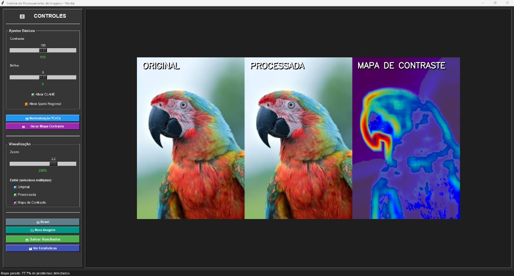

# Processamento-de-Imagens_E01_Grupo1
# Sistema de Processamento de Imagens - Véridia
## Descrição
O projeto "Véridia" é um sistema avançado de processamento de imagens desenvolvido em Python.
Ele permite ajustes de brilho e contraste, aplicação de técnicas como CLAHE (Equalização de Histograma Adaptativa) e análise de iluminação.
O sistema possui uma interface gráfica intuitiva para facilitar o uso, além de funcionalidades para geração de mapas de contraste e visualização detalhada.



## Funcionalidades
- **Ajustes Básicos**: Controle de brilho e contraste.
- **Processamento Avançado**: Suporte a CLAHE e ajustes regionais.
- **Visualização**: Modos de exibição para imagem original, processada e mapa de contraste.
- **Zoom**: Controle de zoom para análise detalhada.
- **Estatísticas**: Análise de iluminação e geração de logs detalhados.

## Tecnologias Utilizadas
- **Linguagem**: Python
- **Bibliotecas**: OpenCV, NumPy, Pillow, Tkinter

## Como Instalar e Executar
1. Certifique-se de ter o Python instalado (versão 3.8 ou superior). Caso não tenha, baixe e instale a partir do site oficial: [Python Downloads](https://www.python.org/downloads/).
2. Clone este repositório:
   ```
   git clone <URL_DO_REPOSITORIO>
   ```
3. Navegue até o diretório do projeto:
   ```
   cd Processamento-de-Imagens_E01_Grupo1
   ```
4. Instale as dependências:
   ```
   pip install -r requirements.txt
   ```
5. Execute o sistema utilizando o Jupyter Notebook:
   ```
   jupyter notebook
   ```
   Em seguida, vá em `src`, abra o arquivo `main.ipynb` e execute as células para iniciar o sistema.

## Descrição Técnica
O sistema utiliza técnicas avançadas de processamento de imagens para realizar ajustes e análises detalhadas. Abaixo estão os principais aspectos técnicos:

- **Ajuste de Brilho e Contraste**: Implementado utilizando operações aritméticas e funções de mapeamento linear para alterar os valores de intensidade dos pixels, permitindo ajustes precisos na iluminação da imagem.
- **CLAHE (Contrast Limited Adaptive Histogram Equalization)**: Equalização de histograma adaptativa que melhora o contraste em regiões específicas da imagem, evitando a amplificação excessiva de ruídos e preservando detalhes importantes.
- **Análise de Iluminação**: Realiza cálculos estatísticos, como média, desvio padrão e histograma, para avaliar a distribuição de intensidade luminosa e identificar padrões de iluminação.
- **Geração de Mapas de Contraste**: Cria representações visuais que destacam as diferenças de contraste em diferentes áreas da imagem, auxiliando na análise detalhada.
- **Interface Gráfica**: Desenvolvida com Tkinter, oferece uma experiência de usuário intuitiva, permitindo carregar, processar e visualizar imagens de forma interativa.
- **Processamento Regional**: Ajustes localizados em áreas específicas da imagem para maior controle sobre o resultado final.

## Licença
Este projeto está licenciado sob os termos da licença MIT. Consulte o arquivo `LICENSE` para mais informações.
