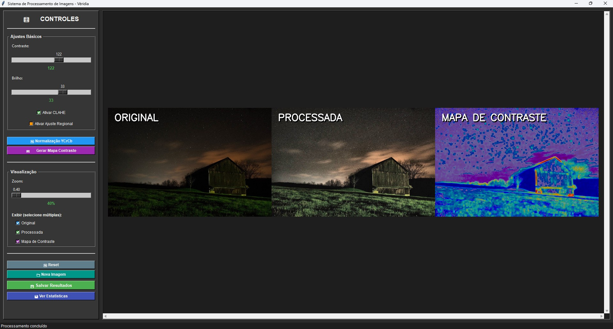
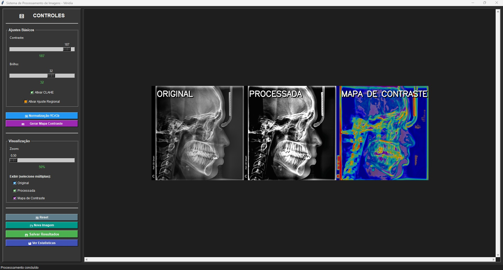
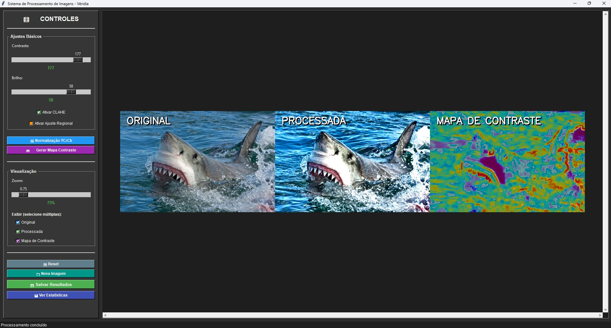
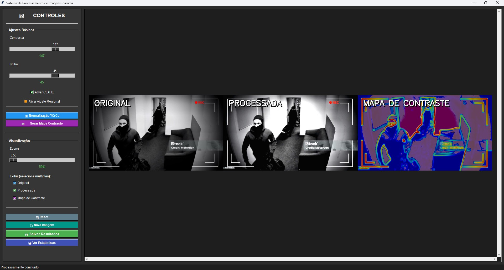

# Processamento-de-Imagens_E01_Grupo1
# Sistema de Processamento de Imagens - Véridia

## Objetivo do Módulo
O projeto "Véridia" é um sistema avançado de processamento de imagens desenvolvido em Python com o objetivo de:
- Melhorar a qualidade visual de imagens com baixa iluminação ou contraste inadequado
- Fornecer ferramentas profissionais para ajuste de brilho e contraste em tempo real
- Aplicar técnicas avançadas de equalização de histograma (CLAHE) para realçar detalhes
- Realizar análise detalhada de iluminação e contraste através de estatísticas e mapas visuais
- Oferecer uma interface gráfica intuitiva que facilite o uso por usuários sem conhecimento técnico aprofundado
- Permitir processamento regional e global de imagens para diferentes cenários de aplicação

## Funcionalidades
- **Ajustes Básicos**: Controle de brilho e contraste.
- **Processamento Avançado**: Suporte a CLAHE e ajustes regionais.
- **Visualização**: Modos de exibição para imagem original, processada e mapa de contraste.
- **Zoom**: Controle de zoom para análise detalhada.
- **Estatísticas**: Análise de iluminação e geração de logs detalhados.

## Bibliotecas Utilizadas
- **Linguagem**: Python 3.8 ou superior
- **Bibliotecas Principais**:
  - **OpenCV (opencv-python)**: Biblioteca principal para processamento de imagens, utilizada para aplicar filtros, conversões de espaço de cor, CLAHE e operações de contraste
  - **NumPy**: Manipulação eficiente de arrays e operações matemáticas nos pixels das imagens
  - **Pillow (PIL)**: Conversão e manipulação de imagens para integração com a interface gráfica Tkinter
  - **Tkinter**: Framework nativo do Python para criação da interface gráfica do usuário (GUI)
  - **Jupyter Notebook**: Ambiente interativo para desenvolvimento e execução do sistema

## Como Instalar e Executar
1. Certifique-se de ter o Python instalado (versão 3.8 ou superior). Caso não tenha, baixe e instale a partir do site oficial: [Python Downloads](https://www.python.org/downloads/).
2. Clone este repositório:
   ```
   git clone <URL_DO_REPOSITORIO>
   ```
3. Navegue até o diretório do projeto:
   ```
   cd Processamento-de-Imagens_E01_Grupo1
   ```
4. Instale as dependências:
   ```
   pip install -r requirements.txt
   ```
5. Execute o sistema utilizando o Jupyter Notebook:
   ```
   jupyter notebook
   ```
   Em seguida, vá em `src`, abra o arquivo `main.ipynb` e execute as células para iniciar o sistema.

## Descrição Técnica
O sistema utiliza técnicas avançadas de processamento de imagens para realizar ajustes e análises detalhadas. 

Abaixo estão os principais aspectos técnicos:

- **Ajuste de Brilho e Contraste**: Implementado utilizando operações aritméticas e funções de mapeamento linear para alterar os valores de intensidade dos pixels, permitindo ajustes precisos na iluminação da imagem.
- **CLAHE (Contrast Limited Adaptive Histogram Equalization)**: Equalização de histograma adaptativa que melhora o contraste em regiões específicas da imagem, evitando a amplificação excessiva de ruídos e preservando detalhes importantes.
- **Análise de Iluminação**: Realiza cálculos estatísticos, como média, desvio padrão e histograma, para avaliar a distribuição de intensidade luminosa e identificar padrões de iluminação.
- **Geração de Mapas de Contraste**: Cria representações visuais que destacam as diferenças de contraste em diferentes áreas da imagem, auxiliando na análise detalhada.
- **Interface Gráfica**: Desenvolvida com Tkinter, oferece uma experiência de usuário intuitiva, permitindo carregar, processar e visualizar imagens de forma interativa.
- **Processamento Regional**: Ajustes localizados em áreas específicas da imagem para maior controle sobre o resultado final.

## Responsabilidades dos Integrantes

### 👥 Equipe de Desenvolvimento

| Integrante                          | Responsabilidades                                                                                                            |
|-------------------------------------|------------------------------------------------------------------------------------------------------------------------------|
| **Carlos Victor Macêdo dos Santos** | Desenvolvimento da interface gráfica (Tkinter), implementação das funcionalidades principais e gerenciamento do repositório. |
| **João Davi Macedo Manadie**        | Implementação dos algoritmos de processamento de imagens (CLAHE, ajuste de brilho/contraste, análise de iluminação).         |
| **Victor Ariel de Lima Gomes**      | Desenvolvimento das documentações semanais e parciais, organização dos relatórios técnicos.                                  |
| **João Luiz Bomfim de Carvalho**    | Gravação e edição do vídeo demonstrativo.                                                                                    |
| **Marcus Vinícius Carvalho Araújo** | Documentação técnica e semanal, análise de requisitos e especificações do sistema.                                           |
| **Maria Luiza Lemos Bastos**        | Elaboração e estruturação do README, organização da documentação do projeto.                                                 |

> **Observação**: Todos os participantes tiveram presença ativa durante o desenvolvimento das ideias, código, criação de exemplos de uso (imagens), testes e validação do sistema.

## Exemplos de Saída

### Interface do Sistema
O sistema apresenta uma interface gráfica intuitiva com controles ajustáveis em tempo real:

- **Painel de Controles**: Ajustes de contraste (0-200), brilho (-100 a +100), ativação de CLAHE e processamento regional
- **Visualização Múltipla**: Exibição simultânea de imagem original, processada e mapa de contraste
- **Controle de Zoom**: Ampliação de 1x até 5x para análise detalhada
- **Estatísticas**: Análise de iluminação com média, desvio padrão e histograma


### Casos de Uso

#### 📷 Imagens com Baixa Luminosidade
O sistema é capaz de melhorar significativamente imagens escuras, revelando detalhes ocultos:
- Imagens de câmeras de segurança noturnas
- Fotografias em ambientes com pouca luz
- Radiografias médicas que necessitam de ajuste de contraste




#### 🔬 Imagens Médicas
Processamento de radiografias e exames de imagem:
- Equalização de histograma adaptativa para realçar estruturas anatômicas
- Ajustes regionais para focar em áreas específicas de interesse
- Mapas de contraste para identificar regiões com baixa definição



#### 🌃 Fotografia
Correção e aprimoramento de fotografias:
- Ajuste de exposição e contraste
- Normalização de iluminação em imagens com iluminação irregular
- Realce de detalhes em áreas de sombra



#### 🎥 Câmeras de Segurança
Processamento de imagens de sistemas de vigilância:
- Melhoria de imagens capturadas em ambientes com pouca iluminação
- Realce de detalhes em gravações noturnas ou em condições adversas
- Ajuste automático de contraste para identificação de objetos e pessoas
- Processamento de imagens de CFTV para análise forense



### Imagens de Exemplo Disponíveis
O projeto inclui diversas imagens de teste na pasta `imagens/`:
- `baixa luminosidade.jpeg` - Teste de correção em ambientes escuros
- `camera de seguranca 1.png` - Simulação de CFTV
- `radiografia 1.jpg` e `radiografia 2.jpg` - Imagens médicas
- `mulher.jpeg`, `rangers.jpeg`, `tubarao.jpg` - Fotografias diversas

## Licença
Este projeto está licenciado sob os termos da licença MIT. Consulte o arquivo `LICENSE` para mais informações.
